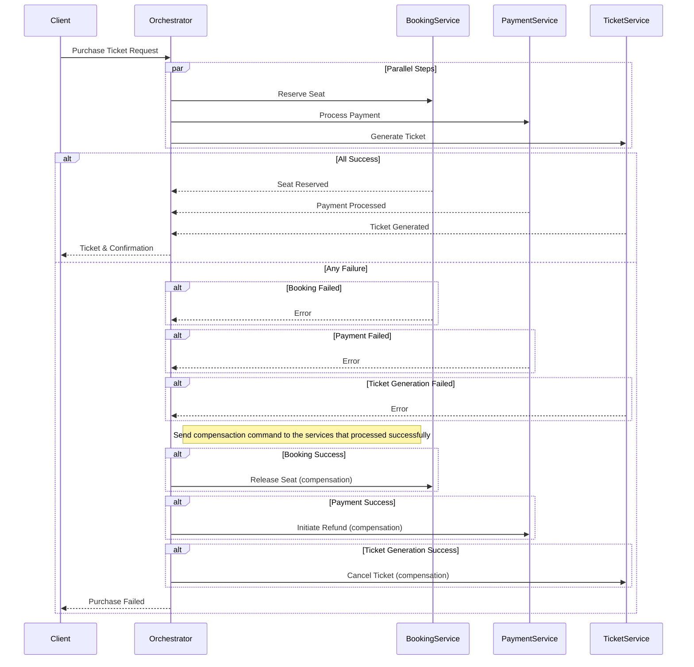

## Purpose

The solution enhances the [basic saga implementation](../saga-state-machine/README.md) with fan-in, fan-out pattern. Hence the downward services are informed **at the same time** and work **in parallel**. The saga moves to the next and final step when it receives events from all invoked services. If any of them fails then the compensation is requested for those of services that processed successfully.

Here is the sequence diagram for the saga:



## Technologies

The solution uses RabbitMQ as a transport, saga state is stored in PostgreSQL. All services are written in .NET 9 with MassTransit as a out-of-the-box implementation of Saga Pattern.

## How to run

* Run docker compose from the current folder with the command: 
```
docker compose up  -d
```
* Open http://localhost:8080/swagger in browser. Invoke `/api/v1/tickets/purchase` method with some `rowNumber` and `seatNumber`.

* Look into Postgres database for the saga state:
```
docker compose exec postgres psql -U root -d TicketSaga
```
Run the query:
```
select * from "PurchaseState";
```
You are expected to see a row that is corresponded with the initiated request and the state should be `CurrentState=Completed`.
