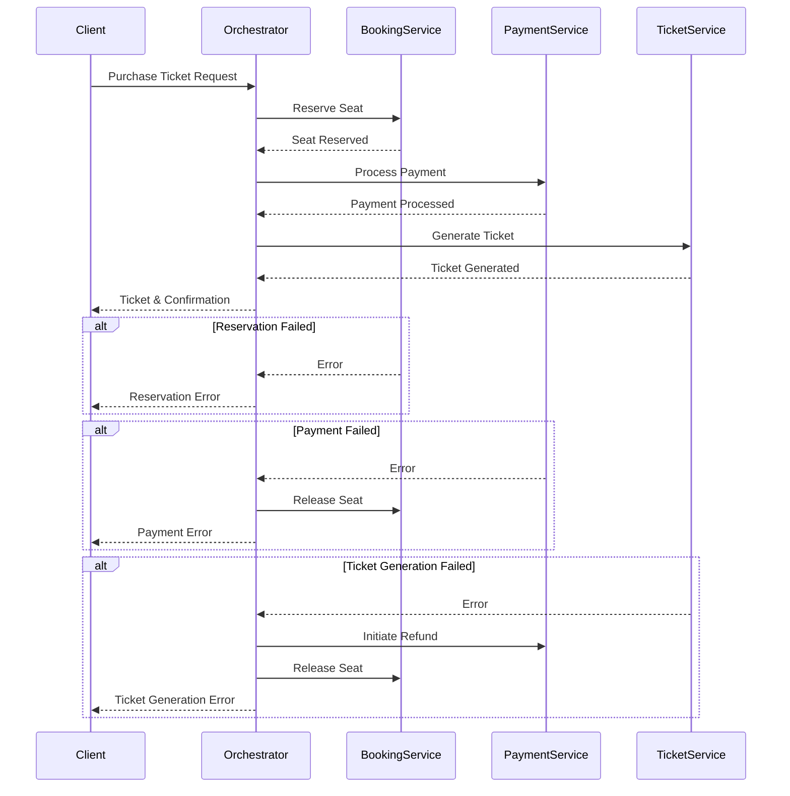
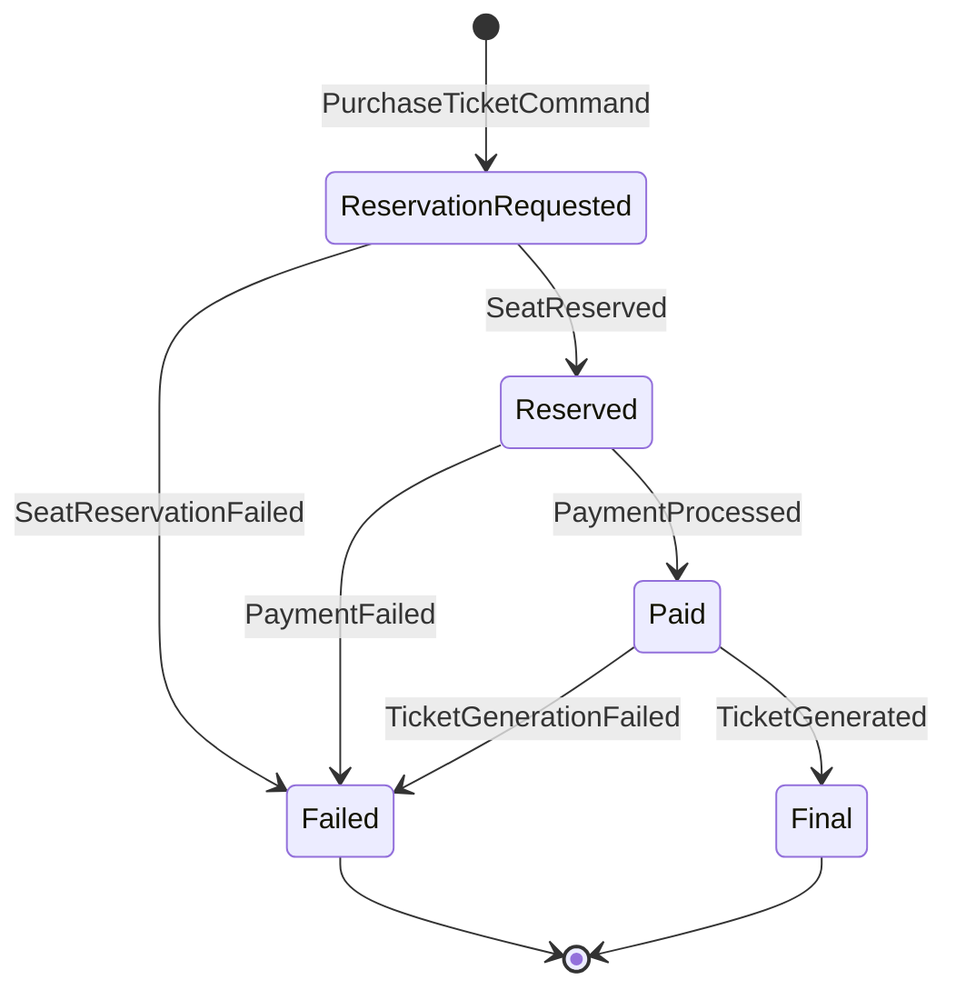

## Purpose

The solution provides a simple demo for how to use Saga State Machine in MassTransit to process a request in a distributed system consisting of the following services:
* **Booking Service**: Booking and booking cancelation of seats in a concert hall
* **Payment Service**
* **Document Service** generates various documents including tickets

Every step of the saga is done in a separate microservice. If a step fails the previous steps are undone (compensated) if it's possible.

Here is the sequence diagram for the saga:



State diagram for the demo:


## Technologies

The solution uses RabbitMQ as a transport, saga state is stored in PostgreSQL. All services are written in .NET 9 with MassTransit as a out-of-the-box implementation of Saga Pattern.

## How to run

* Run docker compose from the current folder with the command: 
```
docker compose up  -d
```
* Open http://localhost:8080/swagger in browser. Invoke `/api/v1/tickets/purchase` method with some `rowNumber` and `seatNumber`.

* Look into Postgres database for the saga state:
```
docker compose exec postgres psql -U root -d TicketSaga
```
Run the query:
```
select * from "PurchaseState";
```
You are expected to see a row that is corresponded with the initiated request and the state should be `CurrentState=Final`.
